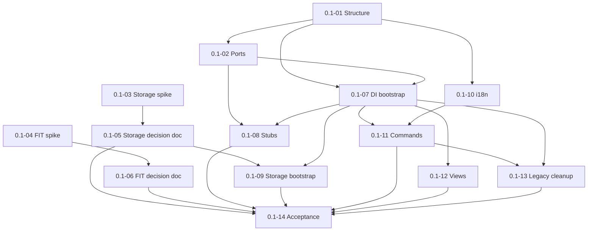

# Milestone 0.1 — Foundation and project skeleton

Источник: [IMPLEMENTATION_PLAN.md](../../IMPLEMENTATION_PLAN.md) (раздел «Milestone 0.1»).

Цель milestone: заложить архитектуру, контракты, bootstrap плагина и закрыть gate-решения по storage и FIT/FIT.GZ до feature-работ.

## Задачи

| ID | Файл | Кратко |
|----|------|--------|
| 0.1-01 | [0.1-01-layered-module-structure.md](./0.1-01-layered-module-structure.md) | Слоистая структура `src/` |
| 0.1-02 | [0.1-02-core-port-interfaces.md](./0.1-02-core-port-interfaces.md) | Port-интерфейсы (repos, parser, logger, metrics) |
| 0.1-03 | [0.1-03-storage-compatibility-spike.md](./0.1-03-storage-compatibility-spike.md) | Spike: storage на desktop/mobile |
| 0.1-04 | [0.1-04-fit-parser-feasibility-spike.md](./0.1-04-fit-parser-feasibility-spike.md) | Spike: FIT/FIT.GZ parser |
| 0.1-05 | [0.1-05-record-storage-decision.md](./0.1-05-record-storage-decision.md) | Решение по storage в TECHNICAL_DESIGN |
| 0.1-06 | [0.1-06-record-fit-parser-decision.md](./0.1-06-record-fit-parser-decision.md) | Решение по FIT в TECHNICAL_DESIGN |
| 0.1-07 | [0.1-07-di-container-bootstrap.md](./0.1-07-di-container-bootstrap.md) | DI-контейнер и bootstrap в `main.ts` |
| 0.1-08 | [0.1-08-service-contract-stubs.md](./0.1-08-service-contract-stubs.md) | Заглушки сервисов за портами |
| 0.1-09 | [0.1-09-storage-bootstrap-migrations-skeleton.md](./0.1-09-storage-bootstrap-migrations-skeleton.md) | Bootstrap адаптера + каркас миграций |
| 0.1-10 | [0.1-10-i18n-foundation.md](./0.1-10-i18n-foundation.md) | i18n EN/RU |
| 0.1-11 | [0.1-11-commands-registration-shell.md](./0.1-11-commands-registration-shell.md) | Команды со stable ID |
| 0.1-12 | [0.1-12-empty-views-registration.md](./0.1-12-empty-views-registration.md) | Пустые, но зарегистрированные view |
| 0.1-13 | [0.1-13-legacy-prototype-cleanup.md](./0.1-13-legacy-prototype-cleanup.md) | Удаление legacy settings/commands |
| 0.1-14 | [0.1-14-milestone-acceptance.md](./0.1-14-milestone-acceptance.md) | Приёмка milestone 0.1 |

## Граф зависимостей

Spike-задачи **0.1-03** и **0.1-04** не зависят от кода слоёв и могут выполняться параллельно с **0.1-01** / **0.1-02**.

## Критерии завершения milestone (сводка)

- `npm run build` и smoke-тест проходят.
- Нет прямых импортов concrete storage вне `infrastructure/`.
- В `docs/TECHNICAL_DESIGN.md` зафиксированы решения по storage и FIT (или явно сужен scope v1 для FIT).
- Milestone **0.2** разблокируется только после **0.1-05**; milestone **0.4** — после **0.1-06** (или явного изменения scope форматов).
