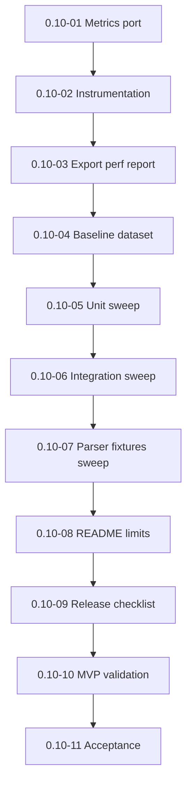

# Milestone 0.10 — Performance baseline and release readiness

Источник: [IMPLEMENTATION_PLAN.md](../../IMPLEMENTATION_PLAN.md) (раздел «Milestone 0.10»).

Цель milestone: perf thresholds, test sweep, README, manifest/release checklist, MVP validation.

## Задачи

| ID | Файл | Кратко |
|----|------|--------|
| 0.10-01 | [0.10-01-metrics-port-implementation.md](./0.10-01-metrics-port-implementation.md) | Реализация Metrics port |
| 0.10-02 | [0.10-02-performance-instrumentation.md](./0.10-02-performance-instrumentation.md) | Performance instrumentation |
| 0.10-03 | [0.10-03-export-performance-report-command.md](./0.10-03-export-performance-report-command.md) | Команда export performance report |
| 0.10-04 | [0.10-04-baseline-dataset-thresholds.md](./0.10-04-baseline-dataset-thresholds.md) | Baseline dataset и thresholds |
| 0.10-05 | [0.10-05-unit-test-sweep.md](./0.10-05-unit-test-sweep.md) | Unit test sweep |
| 0.10-06 | [0.10-06-integration-test-sweep.md](./0.10-06-integration-test-sweep.md) | Integration test sweep |
| 0.10-07 | [0.10-07-parser-fixture-sweep.md](./0.10-07-parser-fixture-sweep.md) | Parser fixture sweep |
| 0.10-08 | [0.10-08-readme-algorithms-privacy-limits.md](./0.10-08-readme-algorithms-privacy-limits.md) | README: algorithms, privacy, limits |
| 0.10-09 | [0.10-09-manifest-versions-release-checklist.md](./0.10-09-manifest-versions-release-checklist.md) | Manifest, versions, release checklist |
| 0.10-10 | [0.10-10-mvp-requirements-validation.md](./0.10-10-mvp-requirements-validation.md) | Валидация Must requirements |
| 0.10-11 | [0.10-11-milestone-acceptance.md](./0.10-11-milestone-acceptance.md) | Приёмка milestone 0.10 |

## Граф зависимостей

## Критерии завершения milestone (сводка)

- PASS/FAIL perf report.
- Must requirements validated.
- Known limitations documented.

## Приёмка milestone (**0.10-11**)

| Поле | Значение |
|------|----------|
| **Дата** | _TBD_ |
| **Версия** | _TBD_ (`manifest.json`) |
| **Результат** | _TBD_ (PASS/FAIL) |
| **Коммит** | _TBD_ |

### Prerequisite

- Milestones **0.1–0.9** complete; MVP feature-complete.
