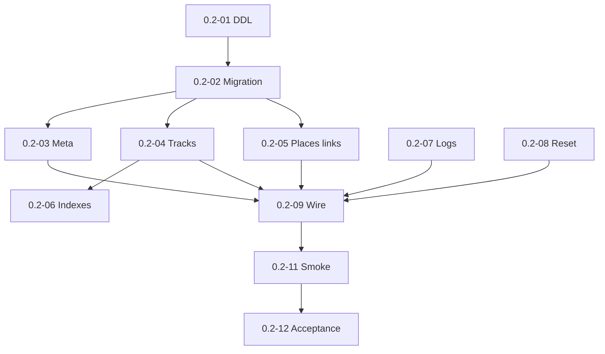

# Milestone 0.2 — Storage schema and indexing meta

Источник: [IMPLEMENTATION_PLAN.md](../../IMPLEMENTATION_PLAN.md) (раздел «Milestone 0.2»).

Цель milestone: подготовить персистентное хранилище: схема v1, миграции, meta, репозитории, ротируемые логи.

## Задачи

| ID | Файл | Кратко |
|----|------|--------|
| 0.2-01 | [0.2-01-v1-logical-schema-ddl.md](./0.2-01-v1-logical-schema-ddl.md) | Логическая схема v1 (DDL) |
| 0.2-02 | [0.2-02-migration-v1-runner.md](./0.2-02-migration-v1-runner.md) | Миграция v1 и runner |
| 0.2-03 | [0.2-03-index-meta-repository.md](./0.2-03-index-meta-repository.md) | Index meta repository |
| 0.2-04 | [0.2-04-track-repository-crud.md](./0.2-04-track-repository-crud.md) | Track repository (CRUD) |
| 0.2-05 | [0.2-05-place-link-repositories.md](./0.2-05-place-link-repositories.md) | Place и note–track repositories |
| 0.2-06 | [0.2-06-query-indexes.md](./0.2-06-query-indexes.md) | Query indexes |
| 0.2-07 | [0.2-07-rotating-file-logs.md](./0.2-07-rotating-file-logs.md) | Ротируемые файловые логи |
| 0.2-08 | [0.2-08-reset-index-behavior.md](./0.2-08-reset-index-behavior.md) | Reset index (только service data) |
| 0.2-09 | [0.2-09-wire-repositories-container.md](./0.2-09-wire-repositories-container.md) | Подключить репозитории в контейнер |
| 0.2-10 | [0.2-10-readme-plugin-data-dir.md](./0.2-10-readme-plugin-data-dir.md) | README: data dir, sync, logs |
| 0.2-11 | [0.2-11-storage-desktop-mobile-smoke.md](./0.2-11-storage-desktop-mobile-smoke.md) | Smoke: storage desktop/mobile |
| 0.2-12 | [0.2-12-milestone-acceptance.md](./0.2-12-milestone-acceptance.md) | Приёмка milestone 0.2 |

## Граф зависимостей

## Критерии завершения milestone (сводка)

- `npm run build` и тесты проходят.
- Fresh vault → schema v1; upgrade path работает.
- Reset index — только service data.
- Desktop/mobile storage smoke PASS.
- README: data dir, sync, logs.

## Gates для следующих milestones

- **0.3 разблокирован:** репозитории и index_meta для scan.

## Приёмка milestone (**0.2-12**)

| Поле | Значение |
|------|----------|
| **Дата** | 2026-05-29 |
| **Версия** | 0.0.1 (`manifest.json`) |
| **Результат** | **PASS** |
| **Коммит** | `0.2-12: milestone 0.2 acceptance gate` (see `git log`) |

### Prerequisite

- Milestone **0.1** complete (**0.1-14** PASS).

### Automated checks (2026-05-29)

| Check | Result |
|-------|--------|
| `npm run build` | PASS (exit 0; incl. `test:bundle` 5 tests) |
| `npm test` | PASS (73 unit + 5 bundle integrity; exit 0) |
| Import architecture gate | PASS (`tests/import-boundaries.test.mjs`: `sql.js` / parser libs only under `src/infrastructure/**`; `application/` + `domain/` clean; `composition/` no direct `sql.js`) |

### Deliverables IMPLEMENTATION_PLAN (0.2)

| Deliverable | Result |
|-------------|--------|
| v1 schema + §6.1 query indexes (**0.2-01**, **0.2-06**) | PASS — `migrations/v1-schema.ts`, migration tests |
| Migration v1 runner on startup (**0.2-02**) | PASS — `runMigrations`, idempotent onload, rollback test |
| Index meta repository (**0.2-03**) | PASS — `first_scan_approved`, `scan_paused`, `last_run_interrupted`, `last_full_scan_at_utc` |
| Track / place / link repositories (**0.2-04**, **0.2-05**) | PASS — CRUD + cascade tests |
| Rotating file logs 5 × 1 MB (**0.2-07**) | PASS — `file-logger.ts`, `tests/log-rotation.test.mjs` |
| Reset index (service data only) (**0.2-08**) | PASS — `reset-index` workflow + mtime test |
| Container wiring (**0.2-09**) | PASS — open → migrate → SQL repos on `onload` |
| README data dir / sync / logs (**0.2-10**) | PASS — `README.md` § Plugin data |
| Storage smoke desktop/mobile (**0.2-11**) | PASS — [evidence/storage-schema-smoke.md](./evidence/storage-schema-smoke.md) |

### Done criteria (summary)

| Criterion | Result |
|-----------|--------|
| Fresh vault → schema v1 | PASS — `storage-migrations`, `storage-schema-smoke` tests |
| Existing DB upgrade path | PASS — export/import + schema version checks |
| Reset index removes only service data | PASS — `reset-index.test.mjs` |
| Desktop/mobile storage smoke | PASS — automated 2026-05-29; optional manual Obsidian steps documented |
| README: data dir, sync, log rotation | PASS |

### Cross-milestone gates (storage layer)

| Gate | Result | Notes |
|------|--------|-------|
| Track files read-only | PASS | Reset workflow does not touch vault track mtimes; index-only writes |
| Missing data explicit | PASS (schema) | `data_flags` JSON column per §6.1; parser fill in **0.4** |
| Broken files visible with diagnostics | PASS (schema) | `tracks.status` + `error_message`; `updateStatus` tests |

### Gates для следующих milestones

| Gate | Status |
|------|--------|
| **0.3 разблокирован** (repos + `index_meta` for scan) | **OPEN** — `TrackRepository`, `IndexMetaRepository` wired in `container.ts` |

### Manual smoke notes

- Obsidian desktop/mobile operator sessions for 0.2-11 dev commands: **optional** (automated PASS documented in evidence).
- Android: derived PASS from **0.1-03** + same sql.js adapter stack; explicit 0.2 mobile session not required for gate.
