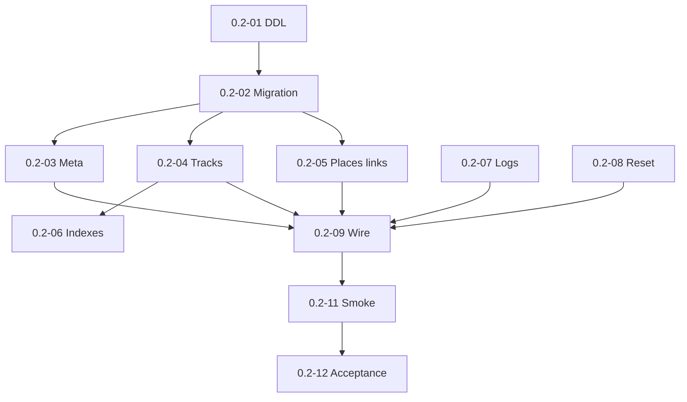

# Milestone 0.2 — Storage schema and indexing meta

Источник: [IMPLEMENTATION_PLAN.md](../../IMPLEMENTATION_PLAN.md) (раздел «Milestone 0.2»).

Цель milestone: подготовить персистентное хранилище: схема v1, миграции, meta, репозитории, ротируемые логи.

## Задачи

| ID | Файл | Кратко |
|----|------|--------|
| 0.2-01 | [0.2-01-v1-logical-schema-ddl.md](./0.2-01-v1-logical-schema-ddl.md) | Логическая схема v1 (DDL) |
| 0.2-02 | [0.2-02-migration-v1-runner.md](./0.2-02-migration-v1-runner.md) | Миграция v1 и runner |
| 0.2-03 | [0.2-03-index-meta-repository.md](./0.2-03-index-meta-repository.md) | Index meta repository |
| 0.2-04 | [0.2-04-track-repository-crud.md](./0.2-04-track-repository-crud.md) | Track repository (CRUD) |
| 0.2-05 | [0.2-05-place-link-repositories.md](./0.2-05-place-link-repositories.md) | Place и note–track repositories |
| 0.2-06 | [0.2-06-query-indexes.md](./0.2-06-query-indexes.md) | Query indexes |
| 0.2-07 | [0.2-07-rotating-file-logs.md](./0.2-07-rotating-file-logs.md) | Ротируемые файловые логи |
| 0.2-08 | [0.2-08-reset-index-behavior.md](./0.2-08-reset-index-behavior.md) | Reset index (только service data) |
| 0.2-09 | [0.2-09-wire-repositories-container.md](./0.2-09-wire-repositories-container.md) | Подключить репозитории в контейнер |
| 0.2-10 | [0.2-10-readme-plugin-data-dir.md](./0.2-10-readme-plugin-data-dir.md) | README: data dir, sync, logs |
| 0.2-11 | [0.2-11-storage-desktop-mobile-smoke.md](./0.2-11-storage-desktop-mobile-smoke.md) | Smoke: storage desktop/mobile |
| 0.2-12 | [0.2-12-milestone-acceptance.md](./0.2-12-milestone-acceptance.md) | Приёмка milestone 0.2 |

## Граф зависимостей

## Критерии завершения milestone (сводка)

- `npm run build` и тесты проходят.
- Fresh vault → schema v1; upgrade path работает.
- Reset index — только service data.
- Desktop/mobile storage smoke PASS.
- README: data dir, sync, logs.

## Gates для следующих milestones

- **0.3 разблокирован:** репозитории и index_meta для scan.

## Приёмка milestone (**0.2-12**)

| Поле | Значение |
|------|----------|
| **Дата** | _TBD_ |
| **Версия** | _TBD_ (`manifest.json`) |
| **Результат** | _TBD_ (PASS/FAIL) |
| **Коммит** | _TBD_ |

### Prerequisite

- Milestone **0.1** complete (**0.1-14** PASS).
