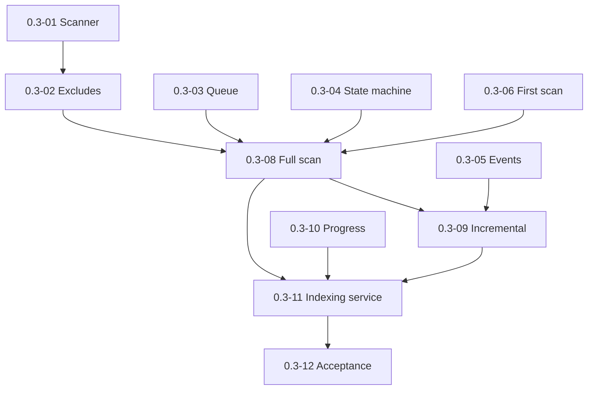

# Milestone 0.3 — Scan engine and file status pipeline

Источник: [IMPLEMENTATION_PLAN.md](../../IMPLEMENTATION_PLAN.md) (раздел «Milestone 0.3»).

Цель milestone: полный/инкрементальный scan vault, машина состояний файлов, first-scan consent и recovery прерванного прогона.

## Задачи

| ID | Файл | Кратко |
|----|------|--------|
| 0.3-01 | [0.3-01-vault-recursive-scanner.md](./0.3-01-vault-recursive-scanner.md) | Рекурсивный scanner vault |
| 0.3-02 | [0.3-02-scan-exclude-patterns.md](./0.3-02-scan-exclude-patterns.md) | Exclude patterns |
| 0.3-03 | [0.3-03-bounded-work-queue.md](./0.3-03-bounded-work-queue.md) | Очередь с bounded concurrency |
| 0.3-04 | [0.3-04-file-state-machine.md](./0.3-04-file-state-machine.md) | Машина состояний файла |
| 0.3-05 | [0.3-05-vault-event-listeners.md](./0.3-05-vault-event-listeners.md) | Слушатели vault events |
| 0.3-06 | [0.3-06-first-scan-consent-ux.md](./0.3-06-first-scan-consent-ux.md) | UX первого скана (consent) |
| 0.3-07 | [0.3-07-interrupted-run-banner.md](./0.3-07-interrupted-run-banner.md) | Баннер прерванной индексации |
| 0.3-08 | [0.3-08-full-scan-workflow.md](./0.3-08-full-scan-workflow.md) | Workflow полного скана |
| 0.3-09 | [0.3-09-incremental-pipeline.md](./0.3-09-incremental-pipeline.md) | Инкрементальный pipeline |
| 0.3-10 | [0.3-10-scan-progress-model.md](./0.3-10-scan-progress-model.md) | Модель прогресса для UI |
| 0.3-11 | [0.3-11-indexing-service-integration.md](./0.3-11-indexing-service-integration.md) | Indexing service (интеграция) |
| 0.3-12 | [0.3-12-milestone-acceptance.md](./0.3-12-milestone-acceptance.md) | Приёмка milestone 0.3 |

## Граф зависимостей

## Критерии завершения milestone (сводка)

- Статусы корректны при create/modify/delete/rename.
- Прерванная индексация детектируется; recovery через явное действие.
- UI отзывчив (bounded concurrency + yield).

## Gates для следующих milestones

- **0.4 разблокирован:** scan может ставить parse jobs в очередь.

## Приёмка milestone (**0.3-12**)

| Поле | Значение |
|------|----------|
| **Дата** | _TBD_ |
| **Версия** | _TBD_ (`manifest.json`) |
| **Результат** | _TBD_ (PASS/FAIL) |
| **Коммит** | _TBD_ |

### Prerequisite

- Milestone **0.2** complete (**0.2-12** PASS).
