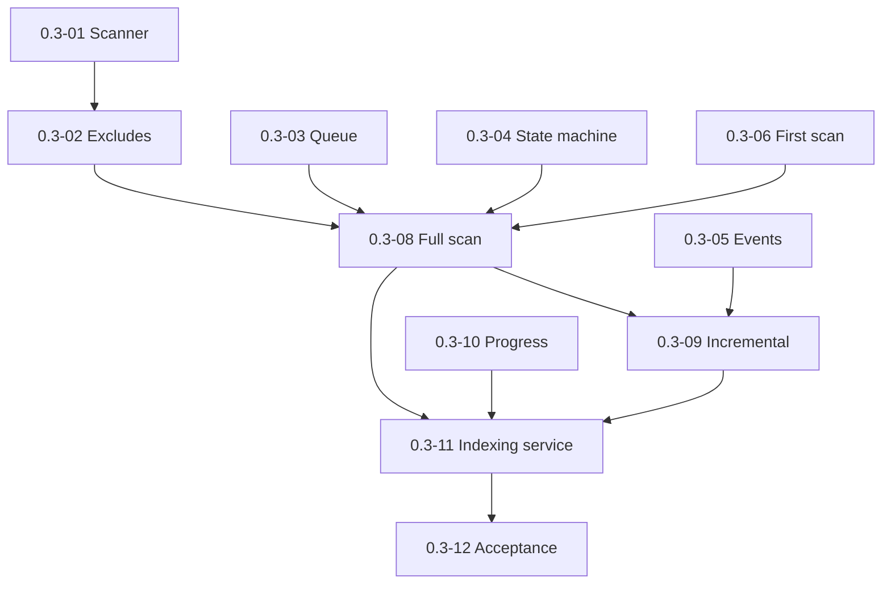

# Milestone 0.3 — Scan engine and file status pipeline

Источник: [IMPLEMENTATION_PLAN.md](../../IMPLEMENTATION_PLAN.md) (раздел «Milestone 0.3»).

Цель milestone: полный/инкрементальный scan vault, машина состояний файлов, first-scan consent и recovery прерванного прогона.

## Задачи

| ID | Файл | Кратко |
|----|------|--------|
| 0.3-01 | [0.3-01-vault-recursive-scanner.md](./0.3-01-vault-recursive-scanner.md) | Рекурсивный scanner vault |
| 0.3-02 | [0.3-02-scan-exclude-patterns.md](./0.3-02-scan-exclude-patterns.md) | Exclude patterns |
| 0.3-03 | [0.3-03-bounded-work-queue.md](./0.3-03-bounded-work-queue.md) | Очередь с bounded concurrency |
| 0.3-04 | [0.3-04-file-state-machine.md](./0.3-04-file-state-machine.md) | Машина состояний файла |
| 0.3-05 | [0.3-05-vault-event-listeners.md](./0.3-05-vault-event-listeners.md) | Слушатели vault events |
| 0.3-06 | [0.3-06-first-scan-consent-ux.md](./0.3-06-first-scan-consent-ux.md) | UX первого скана (consent) |
| 0.3-07 | [0.3-07-interrupted-run-banner.md](./0.3-07-interrupted-run-banner.md) | Баннер прерванной индексации |
| 0.3-08 | [0.3-08-full-scan-workflow.md](./0.3-08-full-scan-workflow.md) | Workflow полного скана |
| 0.3-09 | [0.3-09-incremental-pipeline.md](./0.3-09-incremental-pipeline.md) | Инкрементальный pipeline |
| 0.3-10 | [0.3-10-scan-progress-model.md](./0.3-10-scan-progress-model.md) | Модель прогресса для UI |
| 0.3-11 | [0.3-11-indexing-service-integration.md](./0.3-11-indexing-service-integration.md) | Indexing service (интеграция) |
| 0.3-12 | [0.3-12-milestone-acceptance.md](./0.3-12-milestone-acceptance.md) | Приёмка milestone 0.3 |

## Граф зависимостей

## Критерии завершения milestone (сводка)

- Статусы корректны при create/modify/delete/rename.
- Прерванная индексация детектируется; recovery через явное действие.
- UI отзывчив (bounded concurrency + yield).

## Gates для следующих milestones

- **0.4 разблокирован:** scan может ставить parse jobs в очередь.

## Приёмка milestone (**0.3-12**)

| Поле | Значение |
|------|----------|
| **Дата** | 2026-05-29 |
| **Версия** | 0.0.2 (`manifest.json`) |
| **Результат** | **PASS** |
| **Коммит** | `0.3-12: milestone 0.3 acceptance gate` (see `git log`) |

### Prerequisite

- Milestone **0.2** complete (**0.2-12** PASS).

### Automated checks (2026-05-29)

| Check | Result |
|-------|--------|
| `npm run build` | PASS (exit 0; incl. `test:bundle` 5 tests) |
| `npm run lint` | PASS (exit 0) |
| `npm test` | PASS (133 unit tests; exit 0) |
| Import architecture gate | PASS (`tests/import-boundaries.test.mjs`: `sql.js` / parser libs only under `src/infrastructure/**`; `application/` + `domain/` clean; `composition/` no direct `sql.js`) |

### Deliverables IMPLEMENTATION_PLAN (0.3)

| Deliverable | Result |
|-------------|--------|
| Vault recursive scanner (**0.3-01**) | PASS — `VaultScanner` port/adapter, `tests/vault-scanner.test.mjs` |
| Exclude patterns (**0.3-02**) | PASS — default `.obsidian`/`.trash` + user globs, `tests/exclude-matcher.test.mjs` |
| Bounded work queue (**0.3-03**) | PASS — concurrency cap + micro-batch yield, `tests/work-queue.test.mjs` |
| File state machine (**0.3-04**) | PASS — `pending/indexing/indexed/stale/error`, `tests/file-status.test.mjs` |
| Vault event listeners (**0.3-05**) | PASS — create/modify/delete/rename, `tests/vault-index-events.test.mjs` |
| First-scan consent UX (**0.3-06**) | PASS — sidebar gate until approve, `tests/indexing-service.test.mjs` |
| Interrupted-run banner (**0.3-07**) | PASS — flag persist + resume, `tests/resume-after-interrupt.test.mjs`, sidebar wiring test |
| Full scan workflow (**0.3-08**) | PASS — `runFullScan`, `scan-or-resume-indexing` command, `tests/full-scan.test.mjs` |
| Incremental pipeline (**0.3-09**) | PASS — vault events → status updates + job enqueue, `tests/incremental-index.test.mjs` |
| Scan progress model (**0.3-10**) | PASS — observable counters, `tests/scan-progress.test.mjs` |
| Indexing service integration (**0.3-11**) | PASS — facade wiring, E2E vault scan → DB, `tests/indexing-service.test.mjs` |

### Done criteria (summary)

| Criterion | Result |
|-----------|--------|
| Tracks discovered and statused across lifecycle | PASS — full scan + incremental + state machine tests |
| Interrupted indexing detected and recoverable | PASS — `markInterruptedIfScanActive`, `resumeAfterInterrupt`, banner wiring |
| UI responsive during scan (bounded concurrency + yield) | PASS — work queue cap/yield tests; manual Obsidian session optional |

### Cross-milestone gates (scan layer)

| Gate | Result | Notes |
|------|--------|-------|
| Track files read-only | PASS | Scan/index writes DB only; vault track mtimes untouched (`reset-index` + scan tests) |
| Missing data explicit | PASS (schema + status) | `data_flags` column; parser fill in **0.4**; scan sets `pending` not synthetic metrics |
| Broken files visible with diagnostics | PASS (status model) | `error` status + `error_message`; state machine + `updateStatus` repository tests |

### Gates для следующих milestones

| Gate | Status |
|------|--------|
| **0.4 разблокирован** (scan enqueues parse jobs) | **OPEN** — full/incremental scan enqueue parse jobs; production parser wiring in **0.4-11** |

### Manual smoke notes

- Obsidian desktop/mobile operator sessions: **optional** for gate (automated PASS documented in [evidence/milestone-acceptance.md](./evidence/milestone-acceptance.md)).
- `isDesktopOnly: false` — mobile manual smoke recommended before release, not blocking 0.3 gate.
