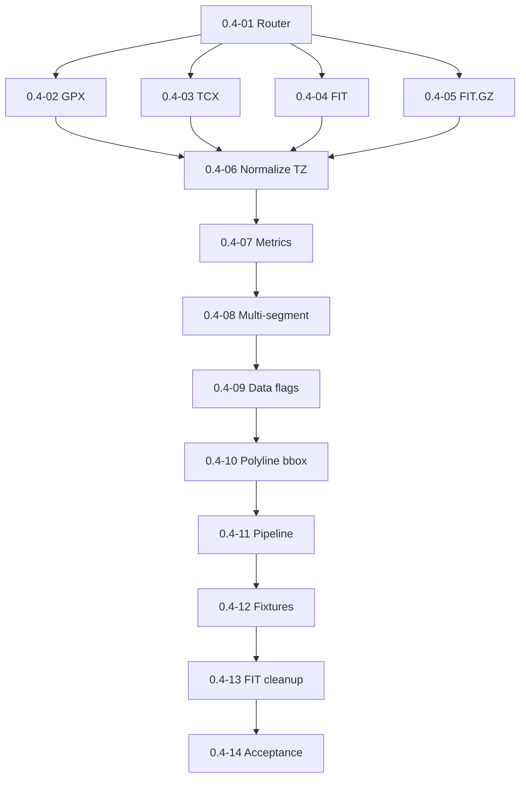

# Milestone 0.4 — Parser normalization and computed metrics

Источник: [IMPLEMENTATION_PLAN.md](../../IMPLEMENTATION_PLAN.md) (раздел «Milestone 0.4»).

Цель milestone: парсинг GPX/TCX/FIT/FIT.GZ в unified model, детерминированные метрики, polyline/bbox, cleanup FIT spike.

## Задачи

| ID | Файл | Кратко |
|----|------|--------|
| 0.4-01 | [0.4-01-parser-router.md](./0.4-01-parser-router.md) | Parser router |
| 0.4-02 | [0.4-02-gpx-parser.md](./0.4-02-gpx-parser.md) | GPX parser |
| 0.4-03 | [0.4-03-tcx-parser.md](./0.4-03-tcx-parser.md) | TCX parser |
| 0.4-04 | [0.4-04-fit-parser.md](./0.4-04-fit-parser.md) | FIT parser (fit-file-parser) |
| 0.4-05 | [0.4-05-fit-gz-parser.md](./0.4-05-fit-gz-parser.md) | FIT.GZ parser |
| 0.4-06 | [0.4-06-timestamp-timezone-normalization.md](./0.4-06-timestamp-timezone-normalization.md) | Нормализация timestamps/timezones |
| 0.4-07 | [0.4-07-computed-metrics-pipeline.md](./0.4-07-computed-metrics-pipeline.md) | Computed metrics (domain) |
| 0.4-08 | [0.4-08-multi-segment-aggregation.md](./0.4-08-multi-segment-aggregation.md) | Multi-segment aggregation |
| 0.4-09 | [0.4-09-data-flags-persistence.md](./0.4-09-data-flags-persistence.md) | Data flags |
| 0.4-10 | [0.4-10-polyline-simplification-bbox.md](./0.4-10-polyline-simplification-bbox.md) | Polyline simplification и bbox |
| 0.4-11 | [0.4-11-indexing-parse-pipeline.md](./0.4-11-indexing-parse-pipeline.md) | Parse pipeline в indexing |
| 0.4-12 | [0.4-12-parser-fixture-tests.md](./0.4-12-parser-fixture-tests.md) | Parser fixture tests |
| 0.4-13 | [0.4-13-fit-spike-cleanup.md](./0.4-13-fit-spike-cleanup.md) | Cleanup FIT spike artifacts |
| 0.4-14 | [0.4-14-milestone-acceptance.md](./0.4-14-milestone-acceptance.md) | Приёмка milestone 0.4 |

## Граф зависимостей

## Критерии завершения milestone (сводка)

- Fixture tests valid/partial/invalid.
- Stable metrics on reindex.
- Explicit missing data flags.
- No `@garmin-fit/sdk` in package.json.

## Gates для следующих milestones

- **0.5 разблокирован:** indexed tracks с метриками для track view.

## Приёмка milestone (**0.4-14**)

| Поле | Значение |
|------|----------|
| **Дата** | _TBD_ |
| **Версия** | _TBD_ (`manifest.json`) |
| **Результат** | _TBD_ (PASS/FAIL) |
| **Коммит** | _TBD_ |

### Prerequisite

- **0.1-06** FIT gate closed.
- Milestone **0.3** complete (**0.3-12** PASS).
