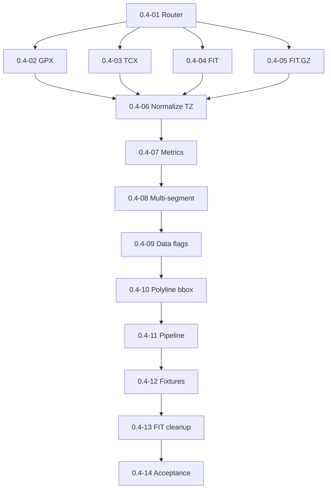

# Milestone 0.4 — Parser normalization and computed metrics

Источник: [IMPLEMENTATION_PLAN.md](../../IMPLEMENTATION_PLAN.md) (раздел «Milestone 0.4»).

Цель milestone: парсинг GPX/TCX/FIT/FIT.GZ в unified model, детерминированные метрики, polyline/bbox, cleanup FIT spike.

## Задачи

| ID | Файл | Кратко |
|----|------|--------|
| 0.4-01 | [0.4-01-parser-router.md](./0.4-01-parser-router.md) | Parser router |
| 0.4-02 | [0.4-02-gpx-parser.md](./0.4-02-gpx-parser.md) | GPX parser |
| 0.4-03 | [0.4-03-tcx-parser.md](./0.4-03-tcx-parser.md) | TCX parser |
| 0.4-04 | [0.4-04-fit-parser.md](./0.4-04-fit-parser.md) | FIT parser (fit-file-parser) |
| 0.4-05 | [0.4-05-fit-gz-parser.md](./0.4-05-fit-gz-parser.md) | FIT.GZ parser |
| 0.4-06 | [0.4-06-timestamp-timezone-normalization.md](./0.4-06-timestamp-timezone-normalization.md) | Нормализация timestamps/timezones |
| 0.4-07 | [0.4-07-computed-metrics-pipeline.md](./0.4-07-computed-metrics-pipeline.md) | Computed metrics (domain) |
| 0.4-08 | [0.4-08-multi-segment-aggregation.md](./0.4-08-multi-segment-aggregation.md) | Multi-segment aggregation |
| 0.4-09 | [0.4-09-data-flags-persistence.md](./0.4-09-data-flags-persistence.md) | Data flags |
| 0.4-10 | [0.4-10-polyline-simplification-bbox.md](./0.4-10-polyline-simplification-bbox.md) | Polyline simplification и bbox |
| 0.4-11 | [0.4-11-indexing-parse-pipeline.md](./0.4-11-indexing-parse-pipeline.md) | Parse pipeline в indexing |
| 0.4-12 | [0.4-12-parser-fixture-tests.md](./0.4-12-parser-fixture-tests.md) | Parser fixture tests |
| 0.4-13 | [0.4-13-fit-spike-cleanup.md](./0.4-13-fit-spike-cleanup.md) | Cleanup FIT spike artifacts |
| 0.4-14 | [0.4-14-milestone-acceptance.md](./0.4-14-milestone-acceptance.md) | Приёмка milestone 0.4 |

## Граф зависимостей

## Критерии завершения milestone (сводка)

- Fixture tests valid/partial/invalid.
- Stable metrics on reindex.
- Explicit missing data flags.
- No `@garmin-fit/sdk` in package.json.

## Gates для следующих milestones

- **0.5 разблокирован:** indexed tracks с метриками для track view.

## Приёмка milestone (**0.4-14**)

| Поле | Значение |
|------|----------|
| **Дата** | 2026-05-29 |
| **Версия** | 0.0.3 (`manifest.json`) |
| **Результат** | **PASS** |
| **Коммит** | `0.4-14: milestone 0.4 acceptance gate` (see `git log`) |

### Prerequisite

- **0.1-06** FIT gate closed.
- Milestone **0.3** complete (**0.3-12** PASS).

### Automated checks (2026-05-29)

| Check | Result |
|-------|--------|
| `npm run build` | PASS (exit 0; incl. `test:bundle` 6 tests) |
| `npm run lint` | PASS (exit 0) |
| `npm test` | PASS (228 unit tests; exit 0) |
| Import architecture gate | PASS (`tests/import-boundaries.test.mjs`: `sql.js` / parser libs only under `src/infrastructure/**`; `application/` + `domain/` clean; `composition/` no direct `sql.js`) |

### Deliverables IMPLEMENTATION_PLAN (0.4)

| Deliverable | Result |
|-------------|--------|
| Parser router + GPX/TCX/FIT/FIT.GZ (**0.4-01**–**0.4-05**) | PASS — `src/infrastructure/parsers/`, fixture matrix 12 cases |
| Timestamp/timezone normalization (**0.4-06**) | PASS — `time-normalization.ts`, 13 unit tests |
| Computed metrics pipeline (**0.4-07**) | PASS — `track-metrics.ts`, 3m elevation threshold, reindex stability |
| Multi-segment aggregation (**0.4-08**) | PASS — `segment-aggregation.ts`, one catalog row + `segments_json` |
| Data flags persistence (**0.4-09**) | PASS — `derive-track-data-flags.ts`, partial fixtures + repo round-trip |
| Polyline simplification + bbox (**0.4-10**) | PASS — `polyline-simplify.ts`, stable reindex output |
| Indexing parse pipeline (**0.4-11**) | PASS — `index-track-file.ts` E2E: valid → indexed, malformed → error |
| Parser fixture tests (**0.4-12**) | PASS — valid/partial/invalid for all v1 formats |
| FIT spike cleanup (**0.4-13**) | PASS — no `@garmin-fit/sdk`; `fit-file-parser` only FIT lib; bundle excludes spike commands |
| Indexed tracks with computed metrics | PASS — `buildIndexedTrackRecord` fills duration, distance, bbox, polyline, segments, flags |
| Error model for malformed files | PASS — `status: error`, `errorMessage`, `errorDetails` with `code=` |

### Done criteria IMPLEMENTATION_PLAN (0.4)

| Criterion | Result |
|-----------|--------|
| Parser fixture tests cover valid/partial/invalid | PASS |
| FIT/FIT.GZ fixture tests included | PASS |
| Stable metrics across reindex runs | PASS (domain + polyline + segment + flags reindex tests) |
| Missing data explicit, no fallback synthesis | PASS |
| No `@garmin-fit/sdk` in production path | PASS |

### Cross-milestone gates

| Gate | Result |
|------|--------|
| Track files read-only | PASS — vault adapter `readBinary` only; index writes DB not vault |
| Missing data explicit | PASS — `TrackDataFlags` + nullable metrics |
| Broken files visible with diagnostics | PASS — error status + message + details in index workflow |

### Residual (non-blocking)

- Obsidian mobile manual FIT smoke (TECHNICAL_DESIGN §2.5) — deferred to release QA.
- Index E2E for `partial-track.gpx` → `indexed` not added; covered by parser matrix + flags repo tests.
