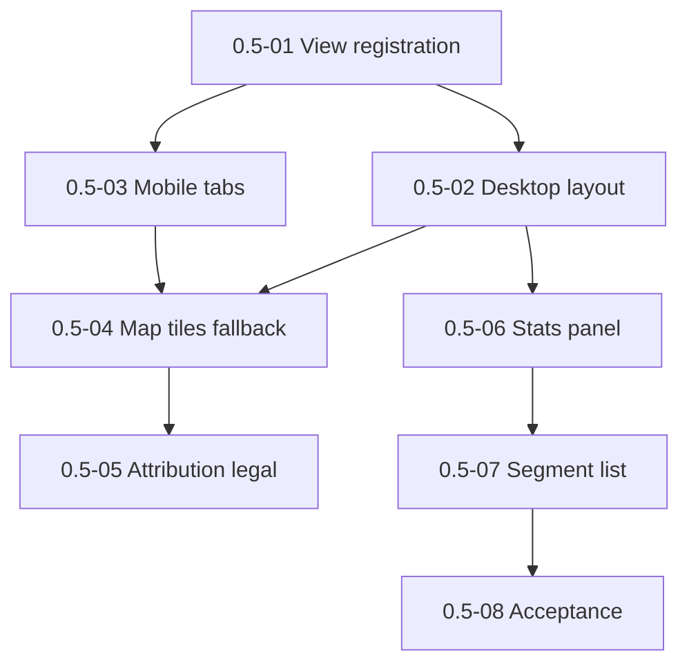

# Milestone 0.5 — Track view (file open -> map + stats)

Источник: [IMPLEMENTATION_PLAN.md](../../IMPLEMENTATION_PLAN.md) (раздел «Milestone 0.5»).

Цель milestone: первый user-visible value: custom view при открытии трек-файла, карта + статистика.

## Задачи

| ID | Файл | Кратко |
|----|------|--------|
| 0.5-01 | [0.5-01-track-view-registration.md](./0.5-01-track-view-registration.md) | Регистрация Track view |
| 0.5-02 | [0.5-02-desktop-layout-map-stats.md](./0.5-02-desktop-layout-map-stats.md) | Desktop layout: map | stats |
| 0.5-03 | [0.5-03-mobile-tabs-layout.md](./0.5-03-mobile-tabs-layout.md) | Mobile layout: tabs map/stats |
| 0.5-04 | [0.5-04-map-tiles-offline-fallback.md](./0.5-04-map-tiles-offline-fallback.md) | Карта: tiles и offline fallback |
| 0.5-05 | [0.5-05-attribution-legal-in-view.md](./0.5-05-attribution-legal-in-view.md) | Attribution и legal text |
| 0.5-06 | [0.5-06-stats-panel-indexed-data.md](./0.5-06-stats-panel-indexed-data.md) | Панель статистики |
| 0.5-07 | [0.5-07-segment-list-ui.md](./0.5-07-segment-list-ui.md) | Список сегментов |
| 0.5-08 | [0.5-08-milestone-acceptance.md](./0.5-08-milestone-acceptance.md) | Приёмка milestone 0.5 |

## Граф зависимостей

## Критерии завершения milestone (сводка)

- Explorer opens custom view for supported extensions.
- Offline/no-tile: geometry + notice.
- Computed metrics only; segments when available.

## Gates для следующих milestones

- **0.6 разблокирован:** navigation target from catalog.

## Приёмка milestone (**0.5-08**)

| Поле | Значение |
|------|----------|
| **Дата** | _TBD_ |
| **Версия** | _TBD_ (`manifest.json`) |
| **Результат** | _TBD_ (PASS/FAIL) |
| **Коммит** | _TBD_ |

### Prerequisite

- Milestone **0.4** complete (**0.4-14** PASS).
