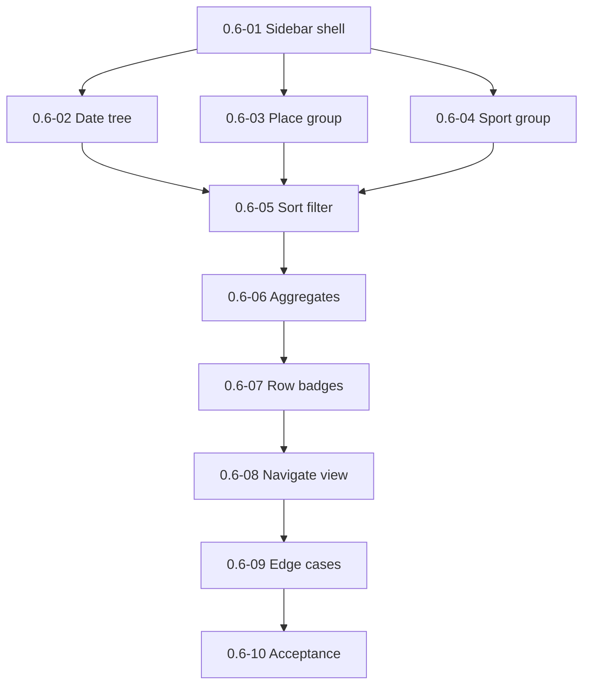

# Milestone 0.6 — Sidebar catalog and filtering

Источник: [IMPLEMENTATION_PLAN.md](../../IMPLEMENTATION_PLAN.md) (раздел «Milestone 0.6»).

Цель milestone: каталог Tracks: группировки, фильтры, агрегаты, навигация в track view.

## Задачи

| ID | Файл | Кратко |
|----|------|--------|
| 0.6-01 | [0.6-01-sidebar-tracks-shell.md](./0.6-01-sidebar-tracks-shell.md) | Sidebar «Tracks» shell |
| 0.6-02 | [0.6-02-date-tree-grouping.md](./0.6-02-date-tree-grouping.md) | Группировка: дата (год→месяц→день) |
| 0.6-03 | [0.6-03-place-grouping.md](./0.6-03-place-grouping.md) | Группировка: place |
| 0.6-04 | [0.6-04-sport-grouping.md](./0.6-04-sport-grouping.md) | Группировка: sport |
| 0.6-05 | [0.6-05-sorting-and-filters.md](./0.6-05-sorting-and-filters.md) | Сортировка и фильтры |
| 0.6-06 | [0.6-06-distance-elapsed-aggregates.md](./0.6-06-distance-elapsed-aggregates.md) | Агрегаты distance/elapsed |
| 0.6-07 | [0.6-07-catalog-row-badges.md](./0.6-07-catalog-row-badges.md) | Поля строки и badges |
| 0.6-08 | [0.6-08-sidebar-to-track-navigation.md](./0.6-08-sidebar-to-track-navigation.md) | Навигация sidebar → track view |
| 0.6-09 | [0.6-09-catalog-edge-cases.md](./0.6-09-catalog-edge-cases.md) | Edge cases каталога |
| 0.6-10 | [0.6-10-milestone-acceptance.md](./0.6-10-milestone-acceptance.md) | Приёмка milestone 0.6 |

## Граф зависимостей

## Критерии завершения milestone (сводка)

- Grouping/filtering on mixed dataset.
- Aggregates match metrics with filters.
- no-date/no-sport/error cases explicit.

## Приёмка milestone (**0.6-10**)

| Поле | Значение |
|------|----------|
| **Дата** | _TBD_ |
| **Версия** | _TBD_ (`manifest.json`) |
| **Результат** | _TBD_ (PASS/FAIL) |
| **Коммит** | _TBD_ |

### Prerequisite

- Milestone **0.5** complete (**0.5-08** PASS).

### Follow-ups from 0.5 smoke

→ [0.5/evidence/manual-smoke-follow-ups.md](../0.5/evidence/manual-smoke-follow-ups.md)

- **0.6-01:** sidebar должен показывать indexed tracks вместо вечного empty-state.
