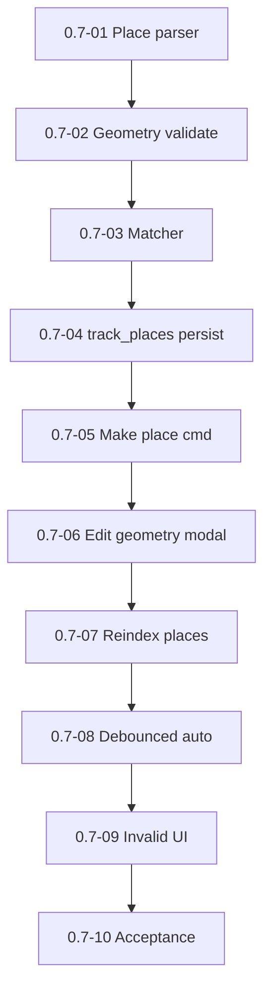

# Milestone 0.7 — Places (frontmatter geometry + relations)

Источник: [IMPLEMENTATION_PLAN.md](../../IMPLEMENTATION_PLAN.md) (раздел «Milestone 0.7»).

Цель milestone: place model, geometry validation/matching, commands, `track_places` relations.

## Задачи

| ID | Файл | Кратко |
|----|------|--------|
| 0.7-01 | [0.7-01-place-frontmatter-parser.md](./0.7-01-place-frontmatter-parser.md) | Парсер place frontmatter |
| 0.7-02 | [0.7-02-geometry-validation.md](./0.7-02-geometry-validation.md) | Валидация геометрии |
| 0.7-03 | [0.7-03-geometry-matcher.md](./0.7-03-geometry-matcher.md) | Geometry matcher |
| 0.7-04 | [0.7-04-track-places-relations.md](./0.7-04-track-places-relations.md) | Persist track_places |
| 0.7-05 | [0.7-05-make-current-note-place.md](./0.7-05-make-current-note-place.md) | Команда: make current note a place |
| 0.7-06 | [0.7-06-edit-place-geometry-modal.md](./0.7-06-edit-place-geometry-modal.md) | Редактирование геометрии place |
| 0.7-07 | [0.7-07-reindex-places-command.md](./0.7-07-reindex-places-command.md) | Команда reindex places |
| 0.7-08 | [0.7-08-debounced-place-auto-reindex.md](./0.7-08-debounced-place-auto-reindex.md) | Debounced auto-reindex place notes |
| 0.7-09 | [0.7-09-invalid-place-ui.md](./0.7-09-invalid-place-ui.md) | Invalid place в UI/индексе |
| 0.7-10 | [0.7-10-milestone-acceptance.md](./0.7-10-milestone-acceptance.md) | Приёмка milestone 0.7 |

## Граф зависимостей

## Критерии завершения milestone (сводка)

- Place changes propagate relations.
- Invalid geometry never crashes; visible in UI.

## Приёмка milestone (**0.7-10**)

| Поле | Значение |
|------|----------|
| **Дата** | _TBD_ |
| **Версия** | _TBD_ (`manifest.json`) |
| **Результат** | _TBD_ (PASS/FAIL) |
| **Коммит** | _TBD_ |

### Prerequisite

- Milestone **0.4**+ indexing (**0.3-12**); **0.6** sidebar can consume relations.
