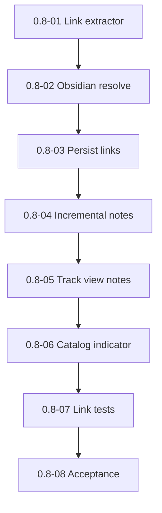

# Milestone 0.8 — Note links and many-to-many relations

Источник: [IMPLEMENTATION_PLAN.md](../../IMPLEMENTATION_PLAN.md) (раздел «Milestone 0.8»).

Цель milestone: индексация Obsidian-ссылок note↔track, UI indicators.

## Задачи

| ID | Файл | Кратко |
|----|------|--------|
| 0.8-01 | [0.8-01-markdown-link-extractor.md](./0.8-01-markdown-link-extractor.md) | Извлечение ссылок из Markdown |
| 0.8-02 | [0.8-02-obsidian-link-resolution.md](./0.8-02-obsidian-link-resolution.md) | Разрешение ссылок Obsidian |
| 0.8-03 | [0.8-03-note-track-links-persistence.md](./0.8-03-note-track-links-persistence.md) | Persist note_track_links |
| 0.8-04 | [0.8-04-incremental-note-indexing.md](./0.8-04-incremental-note-indexing.md) | Инкрементальная индексация заметок |
| 0.8-05 | [0.8-05-track-view-related-notes.md](./0.8-05-track-view-related-notes.md) | Связанные заметки в track view |
| 0.8-06 | [0.8-06-catalog-link-indicator.md](./0.8-06-catalog-link-indicator.md) | Индикатор ссылок в каталоге |
| 0.8-07 | [0.8-07-link-variant-tests.md](./0.8-07-link-variant-tests.md) | Тесты вариантов ссылок |
| 0.8-08 | [0.8-08-milestone-acceptance.md](./0.8-08-milestone-acceptance.md) | Приёмка milestone 0.8 |

## Граф зависимостей

## Критерии завершения milestone (сводка)

- Incremental on note changes.
- Link variant tests pass.

## Приёмка milestone (**0.8-08**)

| Поле | Значение |
|------|----------|
| **Дата** | _TBD_ |
| **Версия** | _TBD_ (`manifest.json`) |
| **Результат** | _TBD_ (PASS/FAIL) |
| **Коммит** | _TBD_ |

### Prerequisite

- **0.2-05** link repository; **0.5** track view shell.
