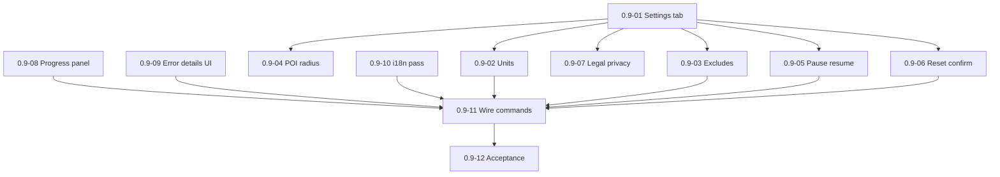

# Milestone 0.9 — Settings, controls, and UX hardening

Источник: [IMPLEMENTATION_PLAN.md](../../IMPLEMENTATION_PLAN.md) (раздел «Milestone 0.9»).

Цель milestone: полный settings tab, progress panel, error details, EN/RU pass, wire commands.

## Задачи

| ID | Файл | Кратко |
|----|------|--------|
| 0.9-01 | [0.9-01-settings-tab-shell.md](./0.9-01-settings-tab-shell.md) | Settings tab (каркас) |
| 0.9-02 | [0.9-02-settings-units.md](./0.9-02-settings-units.md) | Настройка units |
| 0.9-03 | [0.9-03-settings-exclude-patterns.md](./0.9-03-settings-exclude-patterns.md) | Exclude patterns |
| 0.9-04 | [0.9-04-settings-poi-radius.md](./0.9-04-settings-poi-radius.md) | Default POI radius |
| 0.9-05 | [0.9-05-settings-pause-resume-indexing.md](./0.9-05-settings-pause-resume-indexing.md) | Pause/resume indexing |
| 0.9-06 | [0.9-06-settings-reset-rebuild-confirm.md](./0.9-06-settings-reset-rebuild-confirm.md) | Reset/rebuild index + confirmation |
| 0.9-07 | [0.9-07-settings-legal-privacy-block.md](./0.9-07-settings-legal-privacy-block.md) | Legal/privacy block |
| 0.9-08 | [0.9-08-progress-panel-bottom-right.md](./0.9-08-progress-panel-bottom-right.md) | Панель прогресса |
| 0.9-09 | [0.9-09-error-details-ui.md](./0.9-09-error-details-ui.md) | UI деталей ошибок |
| 0.9-10 | [0.9-10-i18n-localization-pass.md](./0.9-10-i18n-localization-pass.md) | EN/RU localization pass |
| 0.9-11 | [0.9-11-wire-commands-real-handlers.md](./0.9-11-wire-commands-real-handlers.md) | Подключить команды к логике |
| 0.9-12 | [0.9-12-milestone-acceptance.md](./0.9-12-milestone-acceptance.md) | Приёмка milestone 0.9 |

## Граф зависимостей

## Критерии завершения milestone (сводка)

- All settings work without restart where feasible.
- Reset flow explicit and safe.

## Gates для следующих milestones

- **0.10 разблокирован:** perf instrumentation + release checklist.

## Приёмка milestone (**0.9-12**)

| Поле | Значение |
|------|----------|
| **Дата** | _TBD_ |
| **Версия** | _TBD_ (`manifest.json`) |
| **Результат** | _TBD_ (PASS/FAIL) |
| **Коммит** | _TBD_ |

### Prerequisite

- Core features **0.3–0.8**; stubs from **0.1-11** replaced with real handlers.
