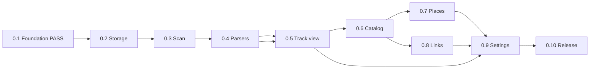

# Milestones — task index

План: [IMPLEMENTATION_PLAN.md](../IMPLEMENTATION_PLAN.md).  
Требования: [REQUIREMENTS.md](../REQUIREMENTS.md), [PRODUCT_SPEC_V1.md](../PRODUCT_SPEC_V1.md).  
Архитектура: [TECHNICAL_DESIGN.md](../TECHNICAL_DESIGN.md).

Каждый milestone — папка с `README.md` (сводка, mermaid-граф), файлами задач `X.Y-NN-slug.md` и финальной **milestone acceptance**.

| Milestone | Название | Задач | README |
|-----------|----------|-------|--------|
| **0.1** | Foundation and project skeleton | 14 | [0.1/README.md](./0.1/README.md) |
| **0.2** | Storage schema and indexing meta | 12 | [0.2/README.md](./0.2/README.md) |
| **0.3** | Scan engine and file status pipeline | 12 | [0.3/README.md](./0.3/README.md) |
| **0.4** | Parser normalization and computed metrics | 14 | [0.4/README.md](./0.4/README.md) |
| **0.5** | Track view (file open → map + stats) | 8 | [0.5/README.md](./0.5/README.md) |
| **0.6** | Sidebar catalog and filtering | 10 | [0.6/README.md](./0.6/README.md) |
| **0.7** | Places (frontmatter geometry + relations) | 10 | [0.7/README.md](./0.7/README.md) |
| **0.8** | Note links and many-to-many relations | 8 | [0.8/README.md](./0.8/README.md) |
| **0.9** | Settings, controls, and UX hardening | 12 | [0.9/README.md](./0.9/README.md) |
| **0.10** | Performance baseline and release readiness | 11 | [0.10/README.md](./0.10/README.md) |

## Цепочка gates

**0.1** закрывает storage gate (**0.2**) и FIT gate (**0.4**). Дальнейшая разработка идёт по порядку IMPLEMENTATION_PLAN; **0.7** / **0.8** частично параллелятся после **0.6**, но приёмка **0.9** требует их завершения.

## Шаблон задачи

Каждый файл задачи содержит: **Цель**, **Зависимости**, **Объём работ**, **Вне scope**, **Условия завершения** (чеклист), **Артефакты**, при необходимости **Блокирует**.

Скрипт генерации: `scripts/generate-milestone-tasks.mjs` (milestones **0.2–0.10**; **0.1** ведётся вручную).
